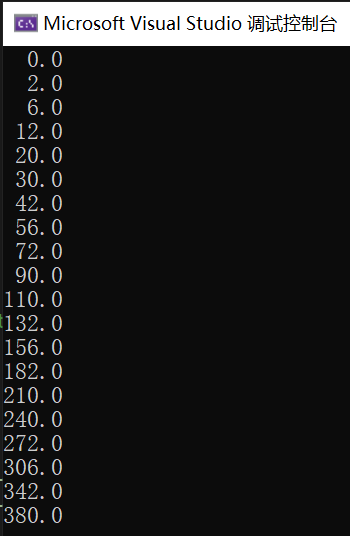
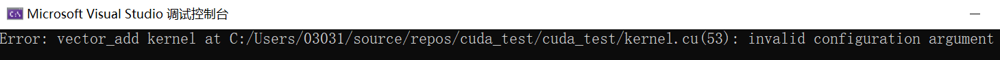
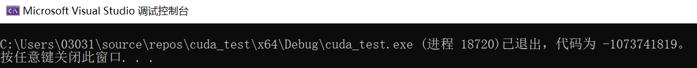
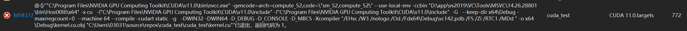
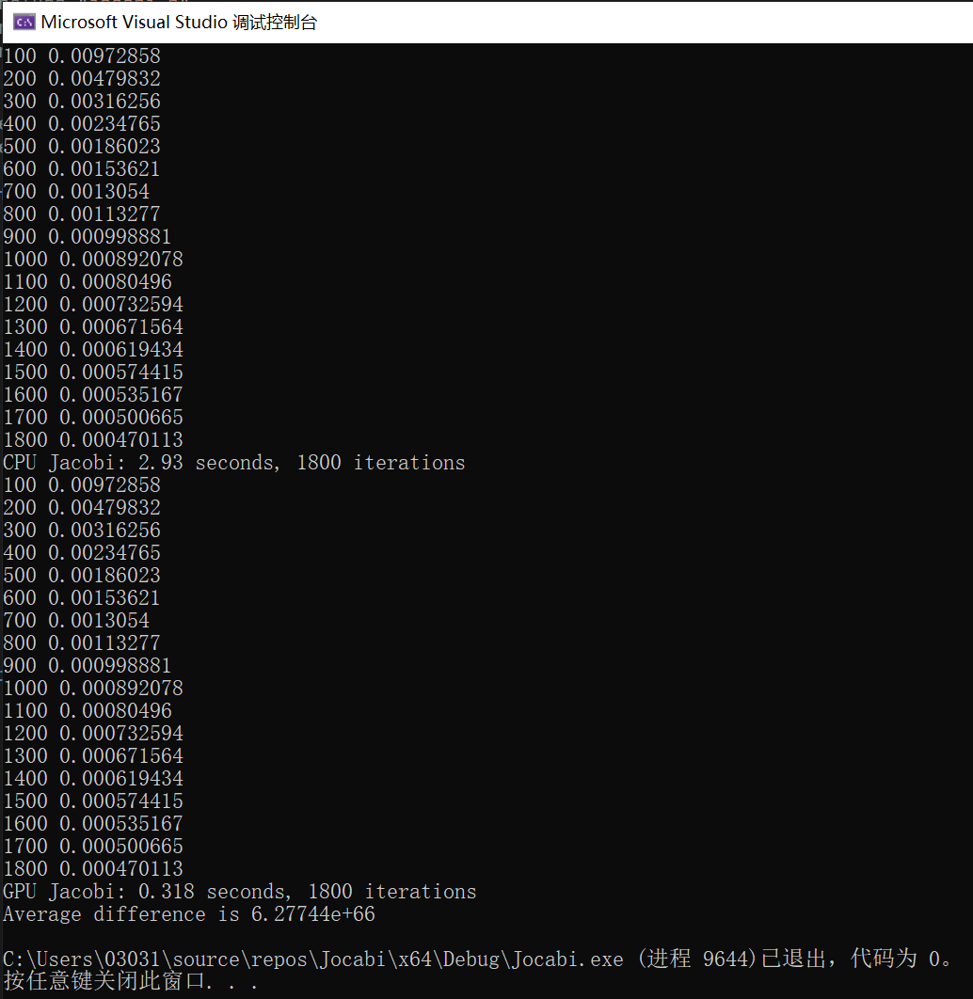
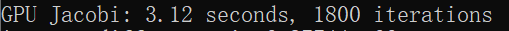
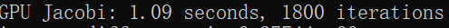
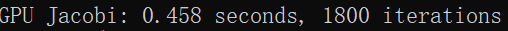
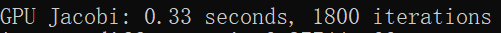

# 并行与分布式作业    六

| 年级 |       班级       |   学号   | 姓名 |
| :--: | :--------------: | :------: | :--: |
| 18级 | 计科（超算方向） | 18340052 | 何泽 |

> ***实验环境：Windows10 + Visual Studio 2019 + CUDA 11.0***

## CUDA-homework-1

> ​		Start from the provided skeleton code `error-test.cu` that provides some convenience macros for error checking. The macros are defined in the header file `error_checks_1.h`. Add the missing memory allocations and copies and the kernel launch and check that your code works. 
>
> 1. What happens if you try to launch kernel with too large block size? When do you catch the error if you remove the `cudaDeviceSynchronize()` call? 
>
> 2. What happens if you try to dereference a pointer to device memory in host code? 
>
> 3.  What if you try to access host memory from the kernel? 
>
>    Remember that you can use also cuda-memcheck! If you have time, you can also check what happens if you remove all error checks and do the same tests again.

### 1. 代码完善

- 核函数

  `vector_add`函数就用原来的就可以，不用更改

  ```c++
  __global__ void vector_add(double* C, const double* A, const double* B, int N)
  {
      // Add the kernel code
      int idx = blockIdx.x * blockDim.x + threadIdx.x;
      // Do not try to access past the allocated memory
      if (idx < N) {
          C[idx] = A[idx] + B[idx];
      }
  }
  ```

- 在`host`上申请内存，拷贝到`device`

  ```c++
  /*
     Add memory allocations and copies. Wrap your runtime function
     calls with CUDA_CHECK( ) macro
  */
  CUDA_CHECK(cudaMalloc((void**)&dA, sizeof(double) * N));
  CUDA_CHECK(cudaMalloc((void**)&dB, sizeof(double) * N));
  CUDA_CHECK(cudaMalloc((void**)&dC, sizeof(double) * N));
  CUDA_CHECK(cudaMemcpy(dA, hA, sizeof(double) * N, cudaMemcpyHostToDevice));
  CUDA_CHECK(cudaMemcpy(dB, hB, sizeof(double) * N, cudaMemcpyHostToDevice));
  ```

- 核函数调用

  ```c++
  //// Add the kernel call here
  vector_add<<<1,16>>>(dC, dA, dB, N);
  ```

- 最后将结果拷贝回host，然后释放

  ```c++
  //// Copy back the results and free the device memory
  CUDA_CHECK(cudaMemcpy(hC, dC, sizeof(double) * N, cudaMemcpyDeviceToHost));
  CUDA_CHECK(cudaFree(dA));
  CUDA_CHECK(cudaFree(dB));
  CUDA_CHECK(cudaFree(dC));
  ```

### 2. 运行

直接在VS里运行：



可以看到将结果都输出且均正确。

> What happens if you try to launch kernel with too large block size?

将核函数调用如下更改：

```c++
vector_add<<<1,2048>>>(dC, dA, dB, N);
```

可以看到如下报错：



> When do you catch the error if you remove the `cudaDeviceSynchronize()` call? 

结果没有变化，没有报错。

> What happens if you try to dereference a pointer to device memory in host code? 

添加以下代码：

```c++
dA[0] = 1;
dB[0] = 1;
dC[0] = 1;
```

运行后直接报错：



> What if you try to access host memory from the kernel? 

我定义了一个全局变量，并在核函数中让此变量加一，编译时出现如下错误：



## CUDA-homework-2

> ​		In this exercise we will implement a Jacobi iteration which is a very simple finite-difference scheme. Familiarize yourself with the provided skeleton. Then implement following things: 
>
> 1. Write the missing CUDA kernel `sweepGPU` that implements the same algorithm as the `sweepCPU` function. Check that the reported averate difference is in the order of the numerical accuracy. 
>
> 2. Experiment with different grid and block sizes and compare the execution times.

- 根据串行的代码可以写出如下的核函数：

  ```c++
  // GPU kernel
  __global__
  void sweepGPU(double* phi, const double* phiPrev, const double* source,
      double h2, int N)
  {
      int i = blockIdx.x * blockDim.x + threadIdx.x;
      int j = blockIdx.y * blockDim.y + threadIdx.y;
      if (i > 0 && j > 0 && i < N - 1 && j < N - 1) {
          int index = i + j * N;
          int i1 = (i - 1) + j * N;
          int i2 = (i + 1) + j * N;
          int i3 = i + (j - 1) * N;
          int i4 = i + (j + 1) * N;
          phi[index] = 0.25 * (phiPrev[i1] + phiPrev[i2] + phiPrev[i3] + phiPrev[i4] - h2 * source[index]);
      }
  }
  ```

- 核函数的调用：

  ```c++
  sweepGPU<<<dimGrid, dimBlock>>>(phiPrev_d, phi_d, source_d, h * h, N);
  sweepGPU<<<dimGrid, dimBlock>>>(phi_d, phiPrev_d, source_d, h * h, N);
  ```

- 将结果拷贝回host

  ```c++
  CUDA_CHECK( cudaMemcpy(phi, phi_d, size, cudaMemcpyDeviceToHost));
  CUDA_CHECK( cudaMemcpy(phiPrev, phiPrev_d, size, cudaMemcpyDeviceToHost));
  ```

- 将内存释放掉

  ```c++
  CUDA_CHECK( cudaFree(phi_d));
  CUDA_CHECK( cudaFree(phiPrev_d));
  CUDA_CHECK( cudaFree(source_d));
  ```

- 运行

  

> Experiment with different grid and block sizes and compare the execution times.

- `block sizes=1`

  

- `block sizes=2`

  

- `block sizes=4`

   

- `block sizes=8`

  

- `block sizes=16`

  

- `block sizes=32`

  

  可以看到，当`block sizes`增加时，运行时间先减小后小幅增加。

  ## 实验总结

  本次实验是我第一次上手写CUDA程序， 总体来说还算顺利，加深了我对CUDA编程方法的理解，更加熟练了。


